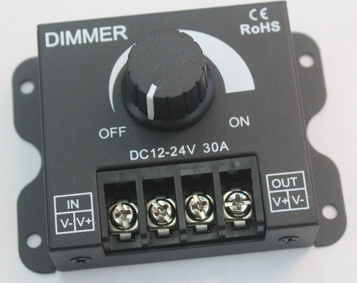

控制器
=========

三路单色温控制器
---------------
功能：结合ESP开发板，控制单色温摄影灯亮度。

输入接口： 1路24V 直流输入，额定功率150W

输出接口： 3路PWM 24V直流输出，单路最大电流5A

控制方式： HOMEKIT APP或WEB

两路双通道控制器
----------------
功能：结合ESP开发板，组成2路2通道控制器，从而控制2个双色温摄影灯。

输入接口：1个24V DC输入

输出接头：2个3Pin航空插头，单路最大5A

控制方式：HomeKit APP或网页控制

RGB控制器
------------------------
应用推荐：*HOME KIT以及ESPHOME的编程学习*

功能：结合ESP开发板，可控制1个RGB灯，1个单色温灯以及一个12V散热风扇。

输入额定功率	150W（总）

输入电压：24V DC

外置天线：2.4G WIFI

适配：ESP32 DEV KIT官方开发板
	
DC标准端子输出：1个；
输出电压：24V；
功率：120W；
亮度调节：PWM

4端口输出：
1个 5.08 4pin端子；
功率	120W；
电压	12-24V；
Pin 1	正极；
Pin 2-4	负极（PWM）

接口类型	
3 pin 2.54mm 接口；
正极	12V DC；
负极	1个；
速度调节	GPIO18 PWM

