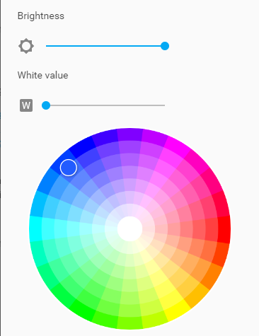

============
摄影灯
============

单色温摄影灯
----------------
色温（CCT）是指光的颜色外观。太阳光在不同的时间点（早中晚）和不同的气象条件下（阴天、雨后灯）使同样的物体呈现不同的质感。日落期间就比正午显得更加温暖。
白光可以很暖，看起来是黄色，琥珀色或橙色，也可以是冷白色，看起来是略带蓝色。

人脸一般在暖白（色温2700-3200k）下显得更加阳光健康，而珠宝在冷白光下显得更加的冷艳高贵(色温6500-7500k)

.. image:: photo/ColorTemperature.jpg

电压：24V

功率：36W

单色温：3200K或5600K

接口：GX12航空插头

线长：1米，2米

双色温摄影灯
-----------------
根据拍摄物体或人物的不同，以及想表现的质感和不同情绪，摄影师会选择不同的色温甚者不同的颜色。
如何解放摄影师的双手使其专注到创意是我们致力打造综合的灯光 和控制系统的出发点。

电压：24V

功率：72W

双色温：3200K和5600K

接口：GX16航空插头

线长：1米，2米

定制商业用灯
-----------------

