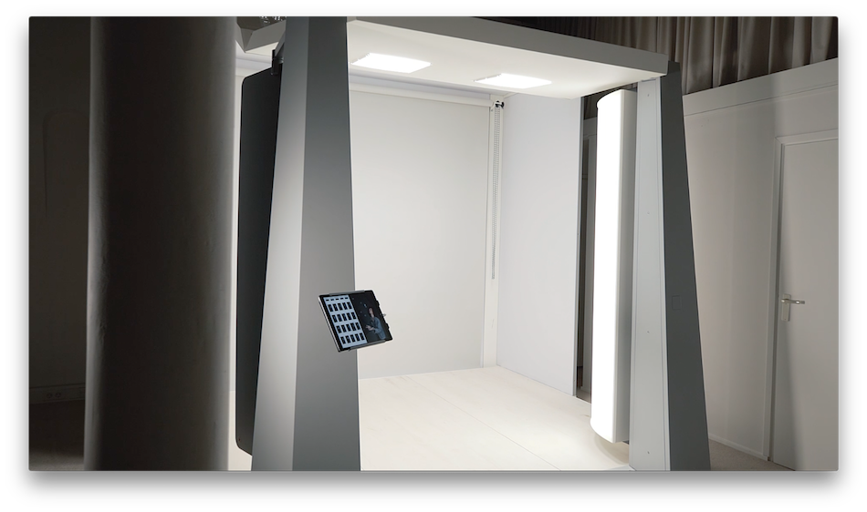

================
灯光定制服务
================

商业场所灯光设计
-----------------

产品服装拍摄现场设计，视频制作中心，直播间以及视频会议室的设计和施工。

光源选择
++++++++++++++++++++

采用高显色指数CRI 高TLCI指数 LED灯珠

Color Rendering Index颜色渲染指数，也称CRI，该指数衡量的是光源与自然光源相比，表现物体颜色的能力。可以简单地理解为CRI值越高，光源能够实现太阳光同样效果的能力越强。
摄影灯的CRI值一般要求95以上，那样才能准确地再现物体本身的颜色。

TLCI 指数 （电视灯光一致性指数） 的制定是为了解决传统 CRI 测量技术的缺陷。 由于摄像机对光线的呈现与人眼感知方式不同，TLCI 光谱仪可更准确地评测电影和演播室灯光的色彩渲染特性

色温选择
+++++++++++++

色温（CCT）是指光的颜色外观。太阳光在不同的时间点（早中晚）和不同的气象条件下（阴天、雨后灯）使同样的物体呈现不同的质感。日落期间就比正午显得更加温暖。白光可以很暖，看起来是黄色，琥珀色或橙色，也可以是冷白色，看起来是略带蓝色。

人脸一般在暖白（色温2700-3200k）下显得更加阳光健康，而珠宝在冷白光下显得更加的冷艳高贵(色温6500-7500k)

.. image:: ../photo/ColorTemperature.jpg

