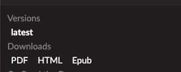

文档网站创建
============

特点及应用领域：
----------------

* 自动生成PDF文档
* 生成产品目录
* 生成可打印文档

适合对象：
---------------
* 外向型公司工厂
* 教育机构
* 美食健康博主
* 技术型公司

云服务
---------------
github+readthedoc

快速搭建一个文档页面型的网站系统，方便用户呈现技术文档、产品目录等。

培训
----------------
* sphinx
* reStructure 文档规范写作
* Github文档管理

外包制作
----------------
为客户提供长期的定制服务。

* 产品摄影
* 视频录制
* 视频会议环境搭建
* 网页内容编辑